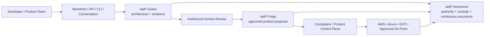

  

<h1 align="center">Infrastructure Product Works™</h1>

<strong>IaaS is what we buy; Infrastructure-as-a-Product is what we build.</strong>

Governed infrastructure products for regulated enterprises — deterministic policy, AI-assisted workflows, multi-cloud control, and verifiable evidence.

---

## Infrastructure should be consumed as a product

Infrastructure Product Works develops a governed Infrastructure-as-a-Product model for organizations that need cloud speed without giving up architecture discipline, traceability, portability, or human authority.

The consumer boundary is a stable infrastructure product contract. Platform teams can then evolve the implementation behind that contract across AWS, Azure, GCP, Kubernetes, Crossplane, GitHub, and approved enterprise tooling without forcing every application team to become an infrastructure integration team.

The architecture separates **experience, validation, approval, generation, control, and assurance** so that AI can assist the lifecycle without becoming the authority boundary.

---

## Portfolio

| Capability | Role |
|---|---|
| **AI-Powered Infrastructure-as-a-Product** | Public thesis, reference architecture, governance model, and portfolio evidence front door |
| **IaaP Guard™** | GitHub-native deterministic architecture and evidence guard |
| **IaaP Forge™** | Converts accepted intent and evidence into bounded infrastructure-product proposals and lifecycle artifacts |
| **IaaP Console™** | Customer-hosted experience for assessment, evidence, planning, selection, and product lifecycle interaction |
| **IaaP Assurance™** | Preserves authority, custody, safeguard continuity, rollback evidence, and continuous assurance |
| **Storefront / Integration Proofs** | Demonstrate bounded product discovery, handoff integrity, selection evidence, and multi-component interoperability |

Some implementation repositories remain private or internal while public repositories carry the architecture, supported public products, sanitized evidence, and claim boundaries.

---

## Public starting points

- **[AI-Powered Infrastructure-as-a-Product](https://github.com/InfrastructureProductWorks/ai-powered-infrastructure-as-a-product)** — start here for the thesis, architecture, roadmap context, evidence model, and multi-cloud product strategy.
- **[IaaP Guard](https://github.com/InfrastructureProductWorks/iaap-guard)** — the supported public GitHub-native architecture and evidence guard.
- **[Enterprise Azure Governance](https://github.com/InfrastructureProductWorks/enterprise-azure-governance)** — enterprise governance patterns and supporting reference work.

---

## What makes the model different

- **Product contract first.** The stable consumer boundary is the infrastructure product, not a Terraform workspace, portal, pipeline, module, or provider-specific implementation.
- **Deterministic gates before AI authority.** AI may interpret, propose, explain, diagnose, or assemble evidence; deterministic policy and authorized people decide what is valid and approved.
- **Multi-cloud by contract, not by slogan.** Provider-specific implementations sit behind portable product interfaces and bounded control-plane patterns.
- **Evidence is part of the product.** Architecture decisions, policy results, approvals, digests, custody references, and lifecycle state are retained as verifiable evidence.
- **Progressive modernization over big-bang replacement.** Legacy systems can remain authoritative while replacement capabilities move onto governed modern infrastructure products by bounded business capability.

---

## Current boundary

The portfolio includes supported public software alongside private and internal research, integration, and assurance work. Published proofs are intentionally bounded unless a repository says otherwise.

A synthetic or bounded PASS means the stated contract and evidence relationships were demonstrated under the published test conditions. It does **not** by itself claim production readiness, customer deployment, certification, an ATO, autonomous infrastructure authority, or unrestricted access to live enterprise systems.

---

<strong>Build infrastructure that behaves like a product — portable, governed, measurable, and provable.</strong>

