  

<h1 align="center">Infrastructure Product Works™</h1>

<strong>IaaS is what we buy; Infrastructure-as-a-Product is what we build.</strong>

<strong>We productize infrastructure with AI — without turning AI into the authority boundary.</strong>

Governed infrastructure products for regulated enterprises. 
Deterministic policy • bounded AI • multi-cloud control • human authority • verifiable evidence

  <a href="https://github.com/InfrastructureProductWorks/ai-powered-infrastructure-as-a-product"><strong>Explore the IaaP thesis</strong></a>
  &nbsp;•&nbsp;
  <a href="https://github.com/InfrastructureProductWorks/iaap-guard"><strong>View IaaP Guard</strong></a>

---

## Productizing infrastructure with AI

Infrastructure Product Works is centered on a simple idea: **AI should make infrastructure easier to consume as a governed product, not make infrastructure less controlled.**

The aim is not to bolt a chatbot onto Infrastructure-as-Code. The aim is to use bounded AI across the infrastructure-product lifecycle so teams can move from intent to a governed product outcome with less manual assembly and less provider-specific friction.

AI can help:

- interpret product intent and translate it into structured requirements;
- propose product selections and bounded changes;
- explain architecture and policy decisions in plain language;
- identify gaps, material changes, and evidence needs;
- generate candidate infrastructure-product artifacts and implementation proposals;
- diagnose sanitized lifecycle state and assemble evidence;
- support progressive modernization by helping teams reason about target-state infrastructure products.

But AI does **not** become the system of authority. Stable product contracts, deterministic validation, policy, tests, source control, human approval, platform controls, IAM, reconciliation, and evidence remain the governing boundaries.

> **AI accelerates the product lifecycle. Deterministic controls and authorized people govern it.**

That is the core Infrastructure Product Works position: **productize infrastructure with AI, then bind that intelligence to explicit contracts, policy, evidence, and authority.**

---

## The product boundary comes first

Infrastructure Product Works is building a governed **Infrastructure-as-a-Product (IaaP)** model for organizations that need cloud speed without surrendering architecture discipline, portability, traceability, or human control.

Developers should order an infrastructure outcome through a stable product contract. The machinery behind that contract can evolve across AWS, Azure, GCP, Kubernetes, Crossplane, GitHub, and approved enterprise tooling without turning every application team into an infrastructure integration team.

  

<em>Developers order the outcome — not the ingredients.</em>

---

## One governed product system

```mermaid
flowchart LR
    DEV[Developer / Product Team]
    EXP[Storefront • API • CLI • Conversation]
    AI[Bounded AI\nintent • proposals • explanation • diagnosis]
    GUARD[IaaP Guard™\nDeterministic architecture + evidence]
    HUMAN[Authorized Human Review]
    FORGE[IaaP Forge™\nBounded product proposal]
    CONTROL[Crossplane / Product Control Plane]
    CLOUD[AWS • Azure • GCP • Approved On-Prem]
    ASSURE[IaaP Assurance™\nAuthority • Custody • Continuous Assurance]

    DEV --> EXP
    EXP --> AI
    AI --> GUARD
    GUARD --> HUMAN
    HUMAN --> FORGE
    FORGE --> CONTROL
    CONTROL --> CLOUD
    GUARD --> ASSURE
    FORGE --> ASSURE
    CLOUD --> ASSURE
    ASSURE --> AI

    classDef experience fill:#0D2438,stroke:#38BDF8,stroke-width:2px,color:#F8FAFC
    classDef intelligence fill:#26163F,stroke:#A855F7,stroke-width:2px,color:#F8FAFC
    classDef guard fill:#0B2F2D,stroke:#14B8A6,stroke-width:2px,color:#F8FAFC
    classDef authority fill:#3B2010,stroke:#FB923C,stroke-width:2px,color:#F8FAFC
    classDef forge fill:#26163F,stroke:#A855F7,stroke-width:2px,color:#F8FAFC
    classDef control fill:#10294B,stroke:#3B82F6,stroke-width:2px,color:#F8FAFC
    classDef assurance fill:#35132D,stroke:#EC4899,stroke-width:2px,color:#F8FAFC
    class DEV,EXP experience
    class AI intelligence
    class GUARD guard
    class HUMAN authority
    class FORGE forge
    class CONTROL,CLOUD control
    class ASSURE assurance
```

The architecture deliberately separates **experience, intelligence, validation, approval, generation, reconciliation, and assurance**. AI can interpret, propose, explain, diagnose, and assemble evidence — but deterministic controls and authorized people remain the decision boundary.

---

## Portfolio

| Product / capability | Responsibility | Public posture |
|---|---|---|
| **AI-Powered Infrastructure-as-a-Product** | Thesis, reference architecture, AI productization model, governance model, roadmap context, and sanitized portfolio evidence | **Public** |
| **IaaP Guard™** | GitHub-native deterministic architecture and evidence guard | **Public** |
| **IaaP Forge™** | Converts accepted intent and evidence into bounded infrastructure-product proposals and lifecycle artifacts | Private implementation |
| **IaaP Console™** | Customer-hosted assessment, evidence, planning, selection, and lifecycle experience | Private implementation |
| **IaaP Assurance™** | Authority, custody, safeguard continuity, rollback evidence, and continuous assurance | Private implementation |
| **Storefront & integration proofs** | Product discovery, handoff integrity, selection evidence, interoperability, and negative testing | Internal / bounded proof |

  

---

## What distinguishes the model

| Principle | What it means in practice |
|---|---|
| **AI productizes infrastructure** | AI helps transform intent, context, and evidence into governed infrastructure-product decisions and proposals instead of merely generating raw IaC. |
| **Product contract first** | Consumers depend on a stable infrastructure product interface — not a Terraform workspace, provider implementation, portal, module, or pipeline. |
| **Deterministic gates before AI authority** | AI can assist the lifecycle, but schemas, policy, tests, evidence, and authorized human approval decide what is valid. |
| **Multi-cloud by contract** | Provider-specific implementations remain replaceable behind stable product contracts rather than leaking into the consumer boundary. |
| **Evidence is part of the product** | Architecture decisions, validation results, approvals, digests, custody references, and lifecycle state are retained as evidence. |
| **Progressive modernization** | Legacy systems can remain authoritative while replacement capabilities move onto governed modern infrastructure products by bounded business capability. |
| **Fail closed** | Missing, altered, mismatched, unauthorized, or unsafe evidence does not silently become permission to proceed. |

---

## Evidence over assertion

  

A claim is only as strong as the reproducible evidence chain behind it. Infrastructure Product Works treats validation, approval, reconciliation, observed state, and custody evidence as first-class parts of the product lifecycle.

---

## Public starting points

### AI-Powered Infrastructure-as-a-Product

**Start with the architecture and strategy.** This is the public front door for the thesis, reference architecture, AI productization model, governance model, product model, roadmap context, modernization position, and sanitized portfolio evidence.

**[Open AI-Powered Infrastructure-as-a-Product →](https://github.com/InfrastructureProductWorks/ai-powered-infrastructure-as-a-product)**

 

### IaaP Guard™

**See the product discipline in action.** IaaP Guard is the supported GitHub-native architecture and evidence guard. Deterministic checks evaluate whether infrastructure is actually being designed and governed as a product.

**[Open IaaP Guard →](https://github.com/InfrastructureProductWorks/iaap-guard)**

 

### Enterprise Azure Governance

**Explore enterprise cloud-governance depth.** This repository contains governance patterns and reference work supporting policy, platform, architecture, and cloud-control thinking.

**[Open Enterprise Azure Governance →](https://github.com/InfrastructureProductWorks/enterprise-azure-governance)**

 

### Explore the portfolio

Private and internal repositories hold bounded implementation, assurance, integration, and product-development work. Public repositories carry the architecture, supported public products, sanitized evidence, and explicit claim boundaries.

**[Explore all public Infrastructure Product Works repositories →](https://github.com/InfrastructureProductWorks?tab=repositories)**

---

## Progressive modernization

The intended destination is not a prettier legacy runtime. The goal is **measurable transfer of business capability and data authority** from legacy estates into governed, portable infrastructure products.

  

Infrastructure Product Works therefore supports a staged model: **stabilize → coexist → transfer → retire**. AI-assisted discovery and transformation may help teams understand and plan the transition, but application and domain teams remain responsible for business meaning, data migration, equivalence, cutover, and retirement decisions. The infrastructure-product system provides the governed destination and evidence chain.

---

## Namespace and provenance

**InfrastructureProductWorks** is the canonical current GitHub namespace for this portfolio. Active links, current operating documentation, and supported product references should use this namespace.

Earlier **SAABOLImpactVenture** references may remain where they are part of immutable historical evidence, original release provenance, archived validation records, or migration continuity. Those references document origin; they do not define the current portfolio identity.

---

## Current claim boundary

The portfolio contains supported public software alongside private and internal research, integration, and assurance work. Published proofs are intentionally bounded unless a repository explicitly states otherwise.

> A synthetic or bounded **PASS** means that the stated contract and evidence relationships were demonstrated under the published test conditions. It does **not** by itself claim production readiness, customer deployment, certification, an ATO, autonomous infrastructure authority, or unrestricted access to live enterprise systems.

---

<strong>Design principles in one minute</strong>

- AI helps productize infrastructure rather than acting as an independent infrastructure authority.
- Stable product contracts outlive provider-specific implementations.
- Backstage or another experience layer is replaceable.
- Crossplane is a reference product control plane, not the consumer-facing product boundary.
- GitHub governs change, review, traceability, and evidence.
- Deterministic policy and tests decide validity.
- Authorized people approve material changes.
- Cloud-native IAM and platform controls remain the ultimate enforcement boundary.
- AI remains bounded by those controls rather than becoming an independent authority.

---

<h3 align="center">Productize infrastructure with AI. Govern it with evidence and authority.</h3>

<strong>Portable. Governed. Measurable. Provable.</strong>

